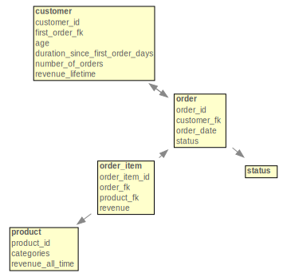
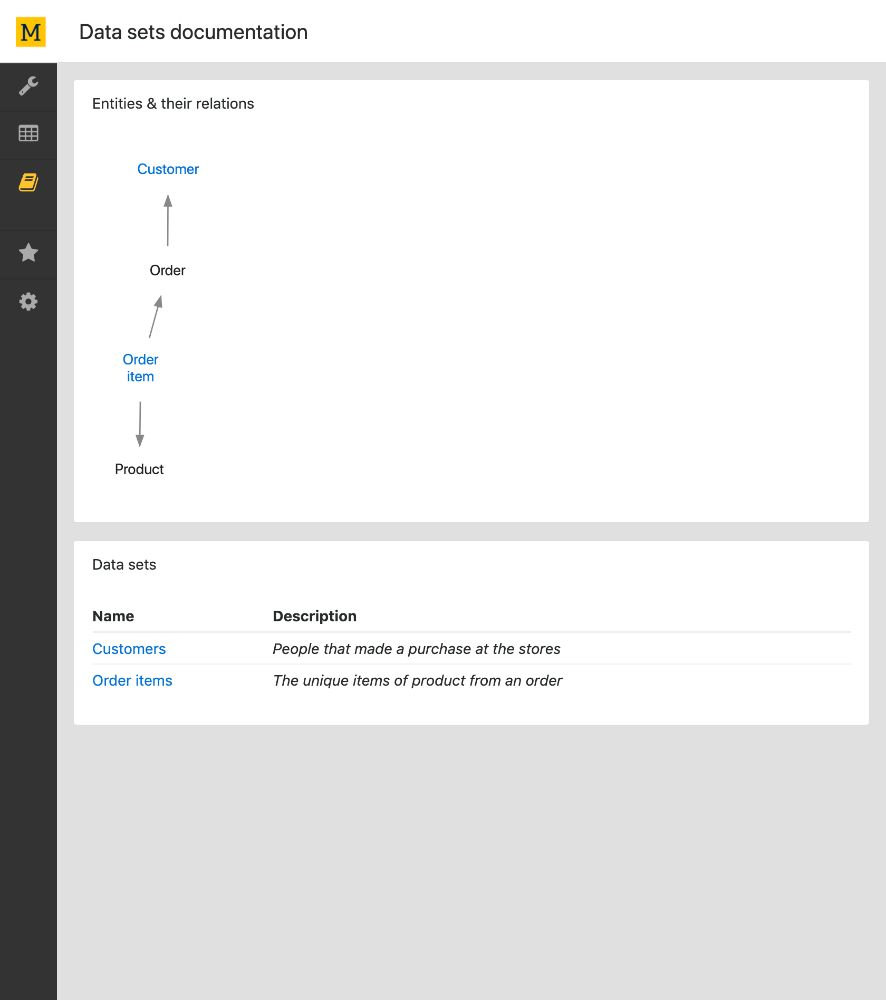
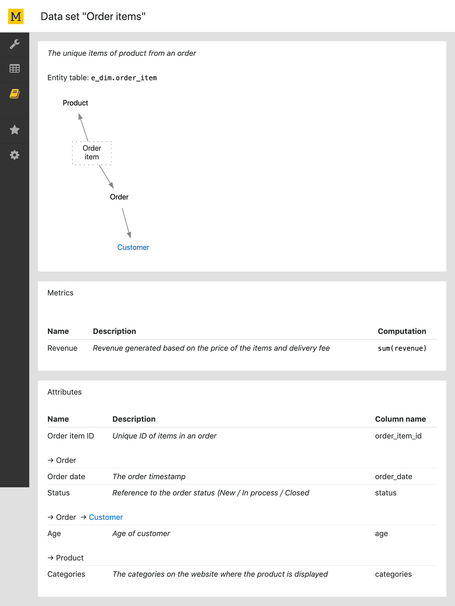

# Mara Schema

This package contains a lightweight opinionated DWH schema management framework which manages business semantics in DWH, automates ETL process and generation of artifacts, and ensures consistency across reporting tools and transparency to DWH users.

## Installation

```bash
pip install mara-schema
```

or

```bash
pip install git+https://github.com/mara/mara-schema.git
```

For an example of an integration into a flask application, have a look at the [mara example project](https://github.com/mara/mara-example-project).

## Example

Please take a look at the following example in order to understand how to configure and use this package in your data integration project.
The example contains the following entities: customer, order, order_item and product.



#### Configure data sets

The file [mara_schema/schema.py](mara_schema/schema.py) contains classes for DataSet, Entity, Metrics, etc. 
The example shows:

- How to create entities and add attributes to entities
- How to link an entity to another entity.
- How to create a data set and add metrics to data set
- How to configure data sets for project by overwriting the `data_sets` function.


```python
from mara_schema.schema import Entity, Type

# Create customer entity
customer_entity = Entity(
    name='Customer', description='People that made a purchase at the stores', schema_name='e_dim')
order_entity = Entity(
    name='Order', description='Orders made at stores at multiple marketplaces', schema_name='e_dim')
product_entity = Entity(
    name='Product', description='Products sold at the stores', schema_name='e_dim')
order_item_entity = Entity(
    name='Order item', description='The unique items of product from an order', schema_name='e_dim')
customer_entity.add_attribute(
    name='Customer ID',
    description='The unique identifier of the customer',
    column_name='customer_id',
    # Attribute with Type.ID is cast to text in flattened table.
    type=Type.ID,
    # High cardinality attributes can be excluded from Mondrian schema.
    # See function `exclude_high_cardinality_dimension_from_mondrian_schema` in config.py
    high_cardinality=True)
customer_entity.add_attribute(
    name='Age',
    description='Age of customer',
    column_name='age',
    # Personal data attributes can be excluded from Mondrian schema.
    # See function include_personal_data_in_mondrian_schema in config.py
    personal_data=True)
customer_entity.add_attribute(
    name='duration since first order days',
    description='Number of days since first order',
    # Attribute with Type.DURATION can be created as Mondrian Dimension with template. 
    # See function `mondrian_dimension_templates` in config.py.
    type=Type.DURATION,
    column_name='duration_since_first_order_days',
    # With accessible_via_entity_link = False, this attribute belongs only to the customer data set.
    accessible_via_entity_link=False)
order_entity.add_attribute(
    name='Order date',
    description='The order timestamp',
    column_name='order_date',
    # Attribute with Type.DATE can be created as Mondrian Dimension with template.
    # See function `mondrian_dimension_templates` in config.py.
    type=Type.DATE)
order_entity.add_attribute(
    name='Status',
    description='Reference to the order status (New / In process / Closed',
    column_name='status',
    # Attributes with Type.ENUM is converted to text in flattened table.
    type=Type.ENUM,
    important_field=True)
order_item_entity.add_attribute(
    name='Order item ID',
    description='Unique ID of items in an order',
    column_name='order_item_id',
    type=Type.ID,
    high_cardinality=True)
product_entity.add_attribute(
    name='Categories',
    description='The categories on the website where the product is displayed',
    column_name='categories',
    # Attribute with Type.ARRAY is excluded in the Mondrian schema.
    type=Type.ARRAY)
# Link order entity to customer entity with first_order_fk
customer_entity.link_entity(
    # Attributes from order entity are with prefix "First order". Prefix is optional
    target_entity=order_entity, fk_column='first_order_fk', prefix='First order')
order_entity.link_entity(
    target_entity=customer_entity, fk_column='customer_fk')
order_item_entity.link_entity(
    target_entity=order_entity, fk_column='order_fk')
order_item_entity.link_entity(
    target_entity=product_entity, fk_column='product_fk')
       
from mara_schema.schema import DataSet, Aggregation

# Create data set customers
customer_data_set = DataSet(
    # the connected entities from customer entity can be reached within 2 entity link instances.
    entity=customer_entity, name='Customers', max_entity_link_depth=2)
order_item_data_set = DataSet(
    entity=order_item_entity, name='Order items', max_entity_link_depth=1)
# The function `add_simple_metric` add a metric "# Order" to customer data set
customer_data_set.add_simple_metric(
    name='# Orders',
    description='Number of purchases made by this customer',
    aggregation=Aggregation.SUM,
    column_name='number_of_orders',
    important_field=True)
customer_data_set.add_simple_metric(
    name='Revenue (lifetime)',
    description='The lifetime revenue generated of items purchased by this customer',
    aggregation=Aggregation.SUM,
    column_name='revenue_lifetime')
# The function `add_composed_metric` creates the metric "Revenue per order" from "Revenue (lifetime)" and "# Orders".
customer_data_set.add_composed_metric(
    name='Revenue per order',
    description='The average revenue of order',
    formula='[Revenue (lifetime)] / [# Orders]')
order_item_data_set.add_simple_metric(
    name='Revenue',
    description='Revenue generated based on the price of the items and delivery fee',
    aggregation=Aggregation.SUM,
    column_name='revenue')
# Exclude the customer entity which is otherwise automatically included.
customer_data_set.exclude_path([('Order', 'First order'), 'Customer'])
# Exclude 'Order date' from order entity in customer data set which is otherwise automatically included.
customer_data_set.exclude_attributes([('Order', 'First order')], ['Order date'])
# Include the customer entity in order item data set, which is otherwise excluded by the max_entity_link_depth.
order_item_data_set.include_path(['Order', 'Customer'])
# Include only the attribute 'Age' from the customer entity.
order_item_data_set.include_attributes(['Order', 'Customer'], ['Age'])

import mara_schema

## configure data sets for project 
mara_schema.config.data_sets = lambda: [customer_data_set, order_item_data_set]

```

#### Web UI for documentation of data sets

[mara_schema/views.py](mara_schema/views.py) contains a web UI for documentation of data sets, relationships between entities and business definitions of columns.




#### Create flattened table and Mondrian fact table

The file [mara_schema/sql_generation.py](mara_schema/sql_generation.py) contains functions to generate SQL for flattened tables and Mondrian fact tables.

The function `sql_for_flattened_table` returns a SQL select statement to create a flattened table. The example below is the generated SQL from the data set customers:

````sql
SELECT "Customer".customer_id  AS "Customer ID",
    "Customer".age  AS "Age",
    "Customer".duration_since_first_order_days  AS "Duration since first order days",
    "First order Order".status :: TEXT AS "First order status"
,    COALESCE("Customer".number_of_orders, 0) AS "# Orders",
    COALESCE("Customer".revenue_lifetime, 0) AS "Revenue (lifetime)",
    (NULLIF(COALESCE("Customer".revenue_lifetime, 0), 0.0)) / (NULLIF(COALESCE("Customer".number_of_orders, 0), 0.0)) AS "Revenue per order"
FROM e_dim.customer "Customer" 
LEFT JOIN e_dim.order "First order Order" ON "Customer".first_order_fk = "First order Order".order_id 
````

The function `sql_for_mondrian_fact_table` returns a SQL create table statement to create a mondrian fact table. You can overwrite the function `mondrian_fact_tables_schema` in the [mara_schema/config.py](mara_schema/config.py) to configure the database schema in which the fact tables are created. The example below is the generated SQL from the data set customers:

`````sql
CREATE TABLE af_dim_next.customer_fact AS
SELECT  "Customer".number_of_orders ,
     "Customer".age ,
     "Customer".revenue_lifetime ,
     "Customer".customer_id ,
     "Customer".duration_since_first_order_days AS     "Duration since first order days (FK)" ,
    "Customer".first_order_fk AS "Customer first_order_fk" 
FROM e_dim.customer "Customer" 
LEFT JOIN e_dim.order "First order Order" ON "Customer".first_order_fk = "First order Order".order_id 
`````

#### Create Mondrian schema

You can overwrite the below functions in the [mara_schema/config.py](mara_schema/config.py) to configure the Mondrian schema:

```python
import pathlib


def mondrian_schema():
    """Returns configuration for Mondrian schema.
    schema_name: This will appear in Mondrian's schema file as the name of the schema. It is recommended use the
        company name.
    fact_table_schema_name: The schema name in database for mondrian fact tables.
    schema_file_dir: The directory to store mondrian schema file.
    """
    return {
        "schema_name": "CompanyXYZ",
        "fact_table_schema_name": "af_dim",
        "schema_file_dir": pathlib.Path('./app/mondrian')
            }


def mondrian_dimension_templates():
    pass    
```

After configuration, you can generate the XML file for Mondrian schema in an activated virtual environment with:
```
$ flask mara_schema.create-mondrian-schema
```
