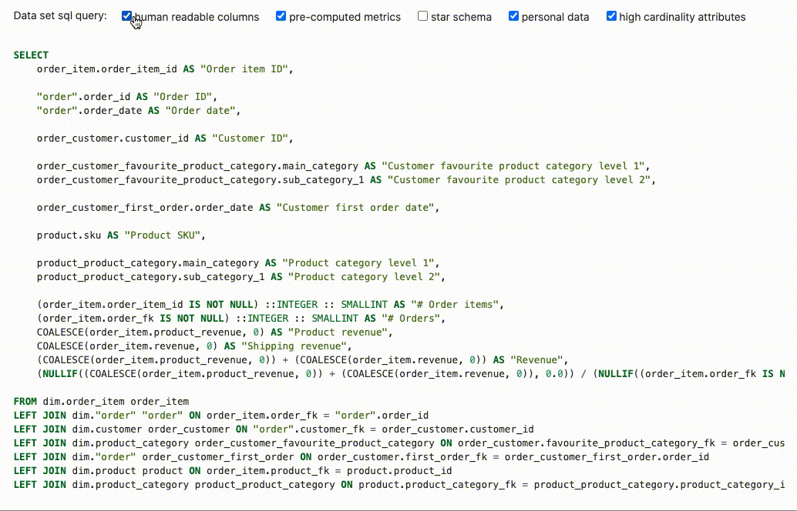

Artifact generation
===================

The function ``data_set_sql_query`` in `mara_schema/sql_generation.py <mara_schema/sql_generation.py>`_ can be used to flatten the entities of a data set into a wide data set table:
.. code-block:: python

    data_set_sql_query(data_set=order_items_data_set, human_readable_columns=True, pre_computed_metrics=False,
                    star_schema=False, personal_data=False, high_cardinality_attributes=True)

The resulting SELECT statement can be used for creating a data set table that is specifically tailored for the use in Metabase:

.. code-block:: sql

    SELECT
        order_item.order_item_id AS "Order item ID",

        "order".order_id AS "Order ID",
        "order".order_date AS "Order date",

        order_customer.customer_id AS "Customer ID",

        order_customer_favourite_product_category.main_category AS "Customer favourite product category level 1",
        order_customer_favourite_product_category.sub_category_1 AS "Customer favourite product category level 2",

        order_customer_first_order.order_date AS "Customer first order date",

        product.sku AS "Product SKU",

        product_product_category.main_category AS "Product category level 1",
        product_product_category.sub_category_1 AS "Product category level 2",

        order_item.order_item_id AS "# Order items",
        order_item.order_fk AS "# Orders",
        order_item.product_revenue AS "Product revenue",
        order_item.revenue AS "Shipping revenue"

    FROM dim.order_item order_item
    LEFT JOIN dim."order" "order" ON order_item.order_fk = "order".order_id
    LEFT JOIN dim.customer order_customer ON "order".customer_fk = order_customer.customer_id
    LEFT JOIN dim.product_category order_customer_favourite_product_category ON order_customer.favourite_product_category_fk = order_customer_favourite_product_category.product_category_id
    LEFT JOIN dim."order" order_customer_first_order ON order_customer.first_order_fk = order_customer_first_order.order_id
    LEFT JOIN dim.product product ON order_item.product_fk = product.product_id
    LEFT JOIN dim.product_category product_product_category ON product.product_category_fk = product_product_category.product_category_id

Please note that the ``data_set_sql_query`` only returns SQL select statements, it's a matter of executing these statements somewhere in the ETL of the Data Warehouse. `Here <https://github.com/mara/mara-example-project-1/tree/master/app/pipelines/generate_artifacts/metabase.py>`_ is an example for creating data set tables for Metabase using `Mara Pipelines <https://github.com/mara/mara-pipelines>`_.

There are several parameters for controlling the output of the `data_set_sql_query` function:

 - ``human_readable_columns``: Whether to use "Customer name" rather than "customer_name" as column name
 - ``pre_computed_metrics``: Whether to pre-compute composed metrics, counts and distinct counts on row level
 - ``star_schema``: Whether to add foreign keys to the tables of linked entities rather than including their attributes
 - ``personal_data``: Whether to include attributes that are marked as personal data
 - ``high_cardinality_attributes``: Whether to include attributes that are marked to have a high cardinality

