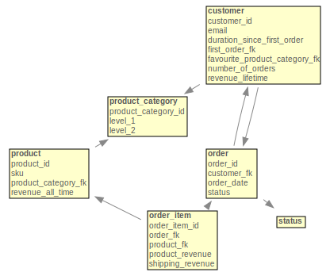

Example
=======

Let's consider the following toy example of a dimensional schema in the data warehouse of a hypothetical e-commerce company:



Each box is a database table with its columns, and the lines between tables show the foreign key constraints. That's a classic Kimball style `snowflake schema <https://en.wikipedia.org/wiki/Snowflake_schema>`_ and it requires a proper modelling / ETL layer in your data warehouse. A script that creates these example tables in PostgreSQL can be found in `example/dimensional-schema.sql <https://github.com/mara/mara-schema/blob/master/mara_schema/example/dimensional-schema.sql>`_.

It's a prototypical data warehouse schema for B2C e-commerce: There are orders composed of individual product purchases (order items) made by customers. There are circular references: Orders have a customer, and customers have a first order. Order items have a product (and thus a product category) and customers have a favourite product category.

The respective entity and data set definitions for this database schema can be found in the `mara_schema/example <https://github.com/mara/mara-schema/tree/master/mara_schema/example>`_ directory.

Entities
--------

In Mara Schema, each business relevant table in the dimensional schema is mapped to an `Entity <https://github.com/mara/mara-schema/blob/master/mara_schema/entity.py>`_. In dimensional modelling terms, entities can be both fact tables and dimensions. For example, a customer entity can be a dimension of an order items data set (a.k.a. "cube", "model", "data mart") and a customer data set of its own.

Here's a `shortened <https://github.com/mara/mara-schema/blob/master/mara_schema/example/entities/order_item.py>`_ defnition of the "Order item" entity based on the ``dim.order_item`` table:

.. code-block:: python

    from mara_schema.entity import Entity

    order_item_entity = Entity(
        name='Order item',
        description='Individual products sold as part of an order',
        schema_name='dim')

It assumes that there is an ``order_item`` table in the ``dim`` schema of the data warehouse, with ``order_item_id`` as the primary key. The optional ``table_name`` and ``pk_column_name`` parameters can be used when another naming scheme for tables and primary keys is used.  

Attributes
----------

`Attributes <https://github.com/mara/mara-schema/blob/master/mara_schema/attribute.py>`_ represent facts about an entity. They correspond to the non-numerical columns in a fact or dimension table:

.. code-block:: python

    from mara_schema.attribute import Type

    order_item_entity.add_attribute(
        name='Order item ID',
        description='The ID of the order item in the backend',
        column_name='order_item_id',
        type=Type.ID,
        high_cardinality=True)

They come with a speaking name (as shown in reporting front-ends), a description and a ``column_name`` in the underlying database table. 

There a several parameters for controlling the generation of artifact tables and the visibility in front-ends: 
- Setting ``personal_data`` to ``True`` means that the attribute contains personally identifiable information and thus should be hidden from most users.
- When ```high_cardinality` is ``True``, then the attribute is hidden in front-ends that can not deal well with dimensions with a lot of values.
- The ``type`` attribute controls how some fields are treated in artifact creation. See `mara_schema/attribute.py#L7 <https://github.com/mara/mara-schema/blob/master/mara_schema/attribute.py#L7>`_.
- An ``important_field`` highlights the data set and is shown by default in overviews.
- When ``accessible_via_entity_link`` is ``False``, then the attribute will be hidden in data sets that use the entity as an dimension.

Linking entities
----------------

The attributes of the dimensions of an entity are recursively linked with the ``link_entity`` method:

.. code-block:: python

    from .order import order_entity
    from .product import product_entity

    order_item_entity.link_entity(target_entity=order_entity, prefix='')
    order_item_entity.link_entity(target_entity=product_entity)

This pulls in attributes of other entities that are connected to an entity table via foreign key columns. When the other entity is called "Foo bar", then it's assumed that there is a ``foo_bar_fk`` in the entity table (can be overwritten with the ``fk_column`` parameter). The optional ``prefix`` controls how linked attributes are named (e.g. "First order date" vs "Order date") and also helps to disambiguate when there are multiple links from one entity to another.

Data Sets
---------

Once all entities and their relationships are established, `Data Sets <https://github.com/mara/mara-schema/blob/master/mara_schema/data_set.py>`_ (a.k.a "cubes", "models" or "data marts") add metrics and attributes from linked entities to an entity:

.. code-block:: python

    from mara_schema.data_set import DataSet

    from ..entities.order_item import order_item_entity

    order_items_data_set = DataSet(entity=order_item_entity, name='Order items')


There are two kinds of `Metrics <https://github.com/mara/mara-schema/blob/master/mara_schema/metric.py>`_ (a.k.a "Measures") in Mara Schema: simple metrics and composed metrics. Simple metrics are computed as direct aggregations on an entity table column:

.. code-block:: python

    from mara_schema.data_set import Aggregation

    order_items_data_set.add_simple_metric(
        name='# Orders',
        description='The number of valid orders (orders with an invoice)',
        column_name='order_fk',
        aggregation=Aggregation.DISTINCT_COUNT,
        important_field=True)

    order_items_data_set.add_simple_metric(
        name='Product revenue',
        description='The price of the ordered products as shown in the cart',
        aggregation=Aggregation.SUM,
        column_name='product_revenue',
        important_field=True)

In this example the metric "# Orders" is defined as the distinct count on the ``order_fk`` column, and "Product revenue" as the sum of the ``product_revenue`` column.

Composed metrics are built from other metrics (both simple and composed)  like this:

.. code-block:: python

    order_items_data_set.add_composed_metric(
        name='Revenue',
        description='The total cart value of the order',
        formula='[Product revenue] + [Shipping revenue]',
        important_field=True)

    order_items_data_set.add_composed_metric(
        name='AOV',
        description='The average revenue per order. Attention: not meaningful when split by product',
        formula='[Revenue] / [# Orders]',
        important_field=True)

The ``formula`` parameter takes simple algebraic expressions (``+``, ``-``, ``*``, ``/`` and parentheses) with the names of the parent metrics in rectangular brackets, e.g. ``([a] + [b]) / [c]``.

Excluding specific entity links
-------------------------------

With complex snowflake schemas the graph of linked entities can become rather big. To avoid cluttering data sets with unnecessary attributes, Mara Schema has a way for excluding entire entity links:

``customers_data_set.exclude_path(['Order', 'Customer'])``

This means that the customer of the first order of a customer will not be part of the customers data set. Similarly, it is possible to limit the list of attributes from a linked entity: 

``order_items_data_set.include_attributes(['Order', 'Customer', 'Order'], ['Order date'])``

Here only the order date of the first order of the customer of the order will be included in the data set.  
