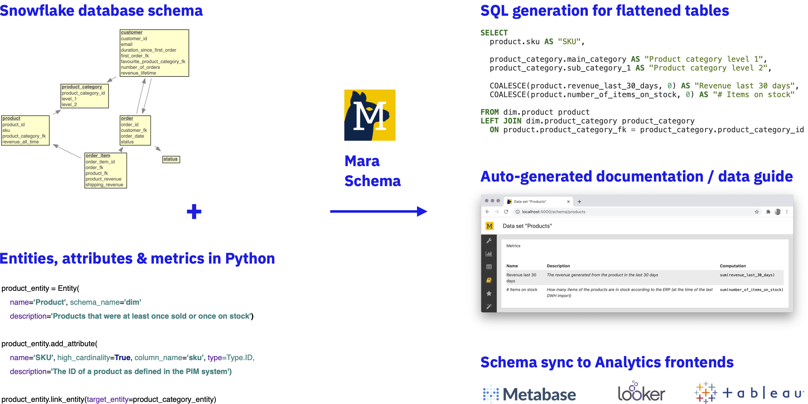

.. rst-class:: hide-header

Mara Schema documentation
=========================

Welcome to Mara Schema's documentation. The Mara Schema package is a Python based mapping of physical data warehouse
tables to logical business entities (a.k.a. "cubes", "models", "data sets", etc.). It comes with 
- sql query generation for flattening normalized database tables into wide tables for various analytics front-ends
- a flask based visualization of the schema that can serve as a documentation of the business definitions of a data warehouse (a.k.a "data dictionary" or "data guide")
- the possibility to sync schemas to reporting front-ends that have meta-data APIs (e.g. Metabase, Looker, Tableau)    

Have a look at a real-world application of Mara Schema in the `Mara Example Project 1 <https://github.com/mara/mara-example-project-1>`_.

**Why** should I use Mara Schema?

1. **Definition of analytical business entities as code**: There are many solutions for documenting the company-wide definitions of attributes & metrics for the users of a data warehouse. These can range from simple spreadsheets or wikis to metadata management tools inside reporting front-ends. However, these definitions can quickly get out of sync when new columns are added or changed in the underlying data warehouse. Mara Schema allows to deploy definition changes together with changes in the underlying ETL processes so that all definitions will always be in sync with the underlying data warehouse schema.

2. **Automatic generation of aggregates / artifacts**: When a company wants to enforce a *single source of truth* in their data warehouse, then a heavily normalized Kimball-style `snowflake schema <https://en.wikipedia.org/wiki/Snowflake_schema>`_ is still the weapon of choice. It enforces an agreed-upon unified modelling of business entities across domains and ensures referential consistency. However, snowflake schemas are not ideal for analytics or data science because they require a lot of joins. Most analytical databases and reporting tools nowadays work better with pre-flattened wide tables. Creating such flattened tables is an error-prone and dull activity, but with Mara Schema one can automate most of the work in creating flattened data set tables in the ETL.
 

User's Guide
------------

This part of the documentation focuses on step-by-step instructions how to use this extension.

.. toctree::
   :maxdepth: 2

   installation
   example
   artifact-generation
   config

API Reference
-------------

If you are looking for information on a specific function, class or
method, this part of the documentation is for you.

.. toctree::
   :maxdepth: 2

   api

Additional Notes
----------------

Legal information and changelog are here for the interested.

.. toctree::
   :maxdepth: 2

   design
   license
   changes